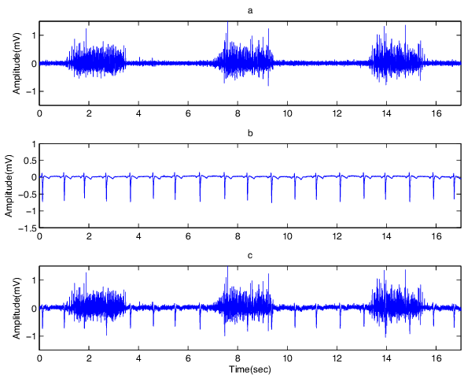
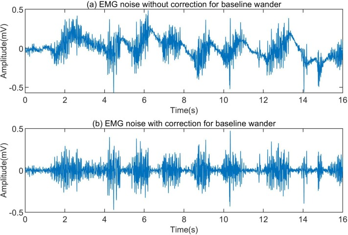
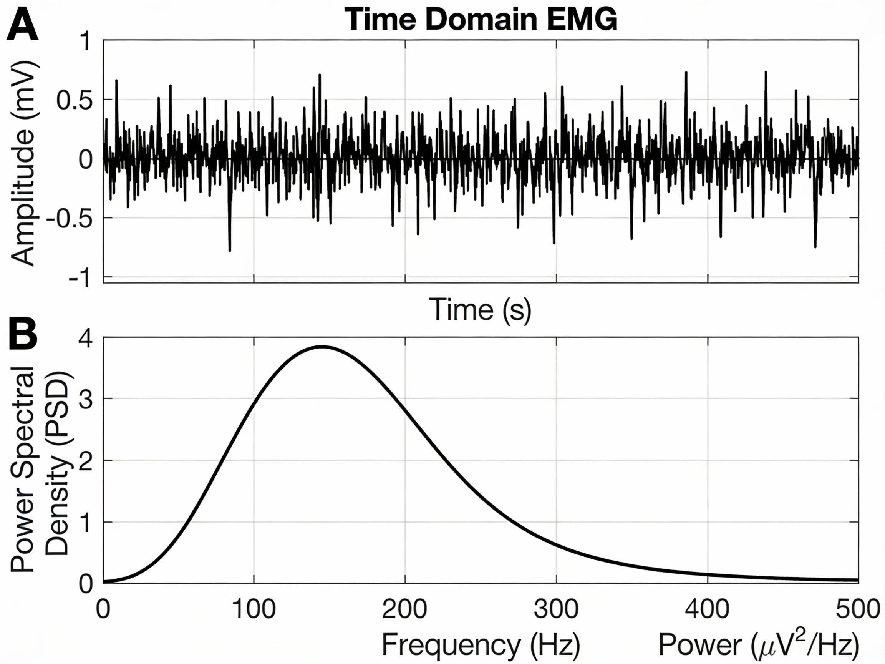
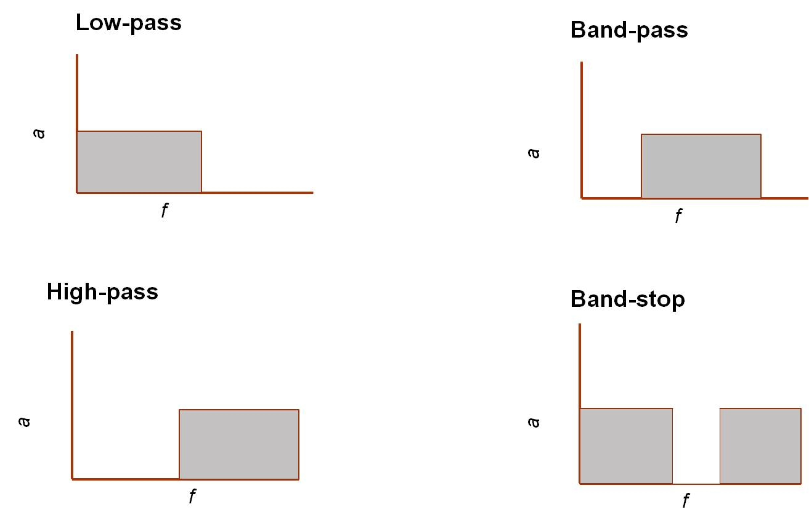
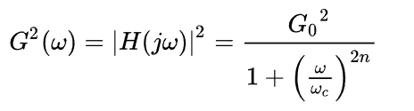
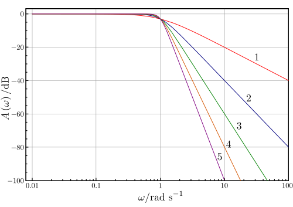

<h4>Introduction</h4>

Electromyogram (EMG) is a biosignal that represents the electrical activity generated by skeletal muscles during contraction and relaxation. These signals arise from the depolarization and repolarization of muscle fibers and reflect the summed action potentials of active motor units. EMG signals typically have small amplitudes (50 μV to 1 mV). Physiological artifacts and non-physiological artifacts can significantly distort EMG recordings, making clinical interpretation and automated processing more challenging.

Accurate filtering is therefore essential to suppress unwanted noise while preserving the essential characteristics of muscle activity, such as onset timing, amplitude, and frequency content. In this experiment, common EMG artifacts are examined and different types of digital filters are applied to enhance signal quality for reliable analysis of muscle function.
 

<h4>Sources of Noise or Artifacts in EMG Signals</h4>
In biomedical signal processing, an artifact refers to any unwanted component in a recorded signal that does not originate from the physiological process of interest. Electromyogram (EMG) signals are particularly prone to noise and artifacts due to their relatively small amplitude, wide frequency content, and the complex mechanical and electrical behavior of skeletal muscles. Since EMG signals are widely used for clinical diagnosis, rehabilitation, prosthetics, and biomechanical analysis, effective noise reduction is essential to ensure accurate interpretation and reliable feature extraction.

Artifacts in EMG recordings can broadly be classified into <b>physiological </b> and <b> non-physiological sources.</b> Physiological artifacts originate from the subject’s own biological activities, whereas non-physiological artifacts arise from the recording system, environment, or measurement setup. Understanding the characteristics and sources of these artifacts is crucial for selecting appropriate filtering techniques and improving EMG signal quality. We can classify the electrical noises affecting the EMG signal into the following:
 

<h4><b>a). Inherent noise in electronics equipment</b></h4>
This type of noise is inherent in all electronic equipment. This noise cannot be eliminated and can only be reduced by using components of high quality and using intelligent circuit design. It has frequency components in range from 0 Hz to several thousand Hertz. An adequate signal-to-noise ratio can be acquired when the EMG signals are recorded using the silver/silver chloride electrode. This is electrically very steady. As the electrode size increases, the impedance decreases.

<h4><b>b). Ambient noise</b></h4>
Ambient noise mainly originates from electromagnetic radiation in the environment. Its amplitude can be one to three times greater than the EMG signal itself. Power-line interference (PLI) at 50 Hz or 60 Hz is a common form of ambient noise. Since the frequency of PLI may fall within the EMG spectrum, it is typically removed using notch or band-stop filters, rather than simple high-pass filtering.

<h4><b>c). Motion artifact</b></h4>
The frequency range of this type of noise is normally between 1–10 Hz. The voltage range is comparable to the amplitude of the EMG signal. The information is distorted when motion artefacts are introduced into the system. This causes irregularities to the data. This is mainly due to the changes in the muscle due to relative motion. There are chances that the electrodes can move from the skin with respect to each other. Also, when the muscle is activated, the length of muscle gets decreased. Thus electrodes will cause movement artefacts. The main sources of this artifact is electrode interface and electrode cable. Proper design of the electronic circuitry is the only way to reduce this artefact. The motion artifact can be removed significantly by using recessed electrodes. In this, between the surface of the skin and the electrode-electrolyte interface, a conductive gel layer is applied.
  

  

 

  <b>Figure 1: Motion artifacts.</b>

<h4><b>d). ECG artifacts</b></h4>
The ECG is an interfering component in the EMG signal taken from the shoulder girdle, which is known as ECG artefact. The EMG taken from the muscles in the trunk often gets affected by ECG artefacts. The EMG electrode placement is an important factor that determines the extent of ECG contamination in an EMG signal. As the frequency spectra of ECG and EMG signals overlap and also as the characteristics such as non-stationarity and varied temporal shape are relative to each other, the removal of ECG artefacts from EMG signals are so difficult.

  

 

  <b>Figure:2 a) Clean EMG, (b) ECG artifact and (c) EMG with added ECG. 
</b>

 

<h4><b>e). Cross talk</b></h4>
It is a type of noise that occurs when an EMG signal that is not desired to monitor at a point of time gets interfered with the desired signal to be monitored. This contaminates the signal and will cause misinterpretation of the information. Even though this can be due to various parameters, by carefully choosing the electrode size and inter-electrode distances, this can be minimized.

<h4><b>f). Electrode contact</b></h4>
The electrode-electrolyte-skin contact will influence the signal-to-noise ratio of an EMG signal. So the skin needs to be ready before the recording of the EMG signal so as to ensure the proper electrode-skin contact.

<h4><b>g). Transducer noise</b></h4>  
This noise is produced at the electrode-skin junction. Electrode converts the ionic currents generated by the muscle contractions into electric currents. So this can be easily stored in either analog or digital form as a voltage potential. The main two noise sources are DC voltage potential and AC voltage potential. The impedance effect is the main cause for this noise and this can be decreased by using Ag-AgCl electrodes.

<h4><b>h). Baseline shifts</b></h4>
The EMG rest-line remains at constant zero and the regular EMG burst returns to zero within a few milliseconds. When the cables shake too much, there is a visible shift of baseline which is greater than 5 ms indicating the artefact. This problem can be solved by correct fixation of electrodes.
 
 

  

 

  <b>Figure 3: Baseline noise.</b>

 
 

<h4>Frequency Spectrum Analysis and Power Spectral Density (PSD)</h4>

The amplitude of surface EMG signals typically ranges from 50 μV to 1 mV, while their useful frequency content primarily lies between 10 Hz and 500 Hz, with dominant power concentrated in the 20–150 Hz band. This frequency range corresponds to the firing rate and conduction velocity of active motor units and contains clinically meaningful information related to muscle activation, fatigue, and neuromuscular function.
 

Frequency-domain analysis using the Fourier Transform (FT) allows the EMG signal to be decomposed into its constituent frequency components, revealing the contribution of each frequency to the overall signal. The Power Spectral Density (PSD) represents the distribution of signal power across the frequency spectrum and provides a clear visualization of both muscle activity and noise components.
 

During sustained, isometric muscle contractions—where the signal can be assumed approximately stationary—the PSD of a healthy EMG signal typically shows a dominant peak between 50 Hz and 100 Hz, with power decreasing toward higher frequencies. Noise-related components appear as excess energy at very low frequencies (motion artifacts) or as narrow spectral peaks (power-line interference).
 

  

 

  <b>Figure 4: (A) Raw EMG signal recorded during a constant-force isometric contraction. (B) The corresponding Power Spectral Density (PSD), illustrating how signal power is distributed across the frequency spectrum.
</b>

 

<h4><b> Filters Used in EMG Processing</b></h4>
There are several digital filtering techniques used to denoise Electromyogram (EMG) signals. Each filter serves a specific purpose based on the frequency characteristics of the EMG signal and the nature of the associated noise. Due to the relatively low amplitude and wide frequency bandwidth of EMG signals, they are highly susceptible to both physiological and non-physiological artifacts. Appropriate filter selection is therefore essential to enhance signal quality while preserving diagnostically and biomechanically relevant muscle information. In this section, commonly used filters for EMG signal conditioning are discussed.
 
 

<h4><b>a). High-Pass Filter</b></h4>
A high-pass filter is used to remove low-frequency artifacts from EMG signals, particularly motion artifacts, baseline drift, and slow variations caused by electrode movement and skin–electrode impedance changes. These unwanted components typically occupy frequencies below 10–20 Hz. In EMG processing, a high-pass filter with a cutoff frequency in the range of 10–20 Hz is commonly employed. This effectively suppresses motion-related noise while preserving the primary EMG frequency components associated with muscle fiber activation.
 

<h4><b>b). Low-Pass Filter</b></h4>
A low-pass filter attenuates high-frequency noise originating from electronic instrumentation, ambient electromagnetic interference, and high-frequency components unrelated to muscle activity.
 

<h4><b>c). Notch Filter (Band-stop)</b></h4>  
A notch filter is specifically designed to eliminate power-line interference at 50 Hz or 60 Hz, which appears as a narrowband sinusoidal disturbance in EMG recordings. Since power-line noise often overlaps with the EMG frequency spectrum, simple high-pass or low-pass filtering is insufficient.
 

<h4><b>d). Band-Pass Filter</b></h4>
A band-pass filter combines the effects of both high-pass and low-pass filters, allowing only a specific frequency band to pass while attenuating frequencies outside this range. In EMG processing, band-pass filtering is commonly used to isolate the primary muscle activity spectrum and improve the signal-to-noise ratio.
 

  

 

  <b>Figure-5:  Four basic filter types (f=frequency , a = amplitude).
</b>

 
 

<h4> <b>Filter Design in EMG Processing</b></h4>
Filtering plays a critical role in EMG signal preprocessing, where the objective is to preserve physiologically meaningful muscle activity while suppressing unwanted artifacts and noise. EMG signals have relatively low amplitudes and a wide frequency bandwidth, which overlaps with various physiological artifacts (motion artifacts, cross-talk) and non-physiological noise (power-line interference, electronic noise). Therefore, careful filter design is essential to ensure accurate interpretation of muscle activation patterns and reliable quantitative analysis.
 
Both Finite Impulse Response (FIR) and Infinite Impulse Response (IIR) filters are widely employed in EMG signal processing due to their complementary advantages in terms of stability, phase response, and computational efficiency. Commonly designed filters include high-pass, low-pass, band-pass, and notch filters, with cutoff frequencies selected based on the known spectral characteristics of EMG signals to remove baseline drift, motion artifacts, high-frequency noise, and power-line interference.
 

<h4><b>Butterworth Filters (IIR)</b></h4>
A Butterworth filter is a type of signal processing filter characterized by a frequency response that is maximally flat over the passband region, meaning it does not introduce ripples within the passband and maintains a smooth amplitude response. This property makes it suitable for applications requiring minimal amplitude distortion within the desired frequency range. In EMG processing, Butterworth filters are preferred for their smooth passband characteristics, which help preserve the true amplitude distribution of muscle activity without introducing artificial spectral distortions. This is particularly important for frequency-domain analysis, fatigue assessment, and power spectral density (PSD) estimation.
  

The frequency response of an <i>n</i>-th order Butterworth low-pass filter is expressed as
 

  

</b>

 
<b>Where:</b>
<ul style="margin-top: 0; margin-bottom: 0;">
  <li><i>G(ω)</i> is the magnitude response (gain)</li>
  <li><i>ω</i> is the angular frequency in radians per second</li>
  <li><i>ωc</i> is the cutoff frequency</li>
  <li><i>n</i> is the filter order (number of poles)</li>
  <li><i>G0</i> is the DC gain (gain at zero frequency)</li>
</ul>

<pre style="margin: 0; font-family: inherit;">
N = 1 .................... 1st order Butterworth filter
N = 2 ............................. 2nd order Butterworth filter
N = 3 ........................................ 3rd order Butterworth filter
</pre>

Order means to improve the accuracy of the filter, if we require more accuracy we require more order (value of N is high).
   
Above Figure 7 shows the magnitude response of Butterworth low-pass filters of orders 1 to 5, all having the same cutoff frequency at ω = 1 rad/s, where the gain falls to −3 dB. As the filter order increases, the passband remains maximally flat while the transition becomes steeper and the stopband roll-off improves from −20 dB/decade for the 1st-order filter to −100 dB/decade for the 5th-order filter. This behavior illustrates the characteristic roll-off slope of 20n dB/decade for Butterworth filters.

  

 

  <b>Figure 6:gain of Butterworth low-pass filters of orders 1 through 5
</b>

 
Like all filters, the typical prototype is the low-pass filter, which can be modified into a high-pass filter.
 

<h4><b>EMG-Specific Butterworth Filter Specifications</b></h4>
For EMG signal filtering, Butterworth filters are commonly implemented with the following configurations:
 
<ul style="margin-top: 0; margin-bottom: 0;">
  <li>High-pass Butterworth filter</li>
  <li>Low-pass Butterworth filter</li>
  <li>Band-pass Butterworth filter</li>
  <li>Notch Butterworth filter</li>
</ul>
 

<h4><b>Window-Based FIR Filters</b></h4>
The Finite Impulse Response (FIR) filter is a digital filter whose impulse response has a strictly finite duration. When an impulse is applied at the input, the output is non-zero only for a limited number of samples and then becomes exactly zero. Because FIR filters are realized without feedback and use only present and past input samples, they are inherently stable and structurally simple to implement. Their behavior is fully determined by a finite set of coefficients, which can be chosen to yield an exactly linear-phase response. This ensures that all frequency components of the input signal experience the same time delay and that waveform shapes are preserved.
 
The windowing technique is one of the quickest and simplest methods for designing FIR filters. Filters designed using the windowing technique approximate ideal filters with some approximation error. Designing an ideal low-pass filter in the frequency domain with a cutoff frequency Fc and transforming it into the time domain results in a sinc function that extends infinitely in both directions. This leads to a very large number of taps, which is not practical, and therefore the impulse response must be truncated. To achieve this, the impulse response is multiplied by a window function, which truncates the infinite impulse response to a finite length required for FIR filter implementation. Different window functions are used for this purpose.
 
 

<b>Common windows include:</b>
<ul style="margin-top: 0; margin-bottom: 0;">
  <li>Rectangular window</li>
  <li>Hamming window</li>
  <li>Hanning window</li>
  <li>Blackman window</li>
  <li>Kaiser window</li>
  <li>Bartlett window</li>
</ul>
 
 

<h4><b>Window Function Characteristics</b></h4>
<ul style="margin-top: 0; margin-bottom: 0;">
  <li><b>Main-lobe width:</b> Controls the sharpness of the transition band between passband and stopband.</li>
  <li><b>Side-lobe level:</b> Determines how effectively the filter suppresses noise and reduces spectral leakage.</li>
  <li><b>Filter order (length):</b> Sets the trade-off between filter accuracy and computational complexity.</li>
</ul>
 
